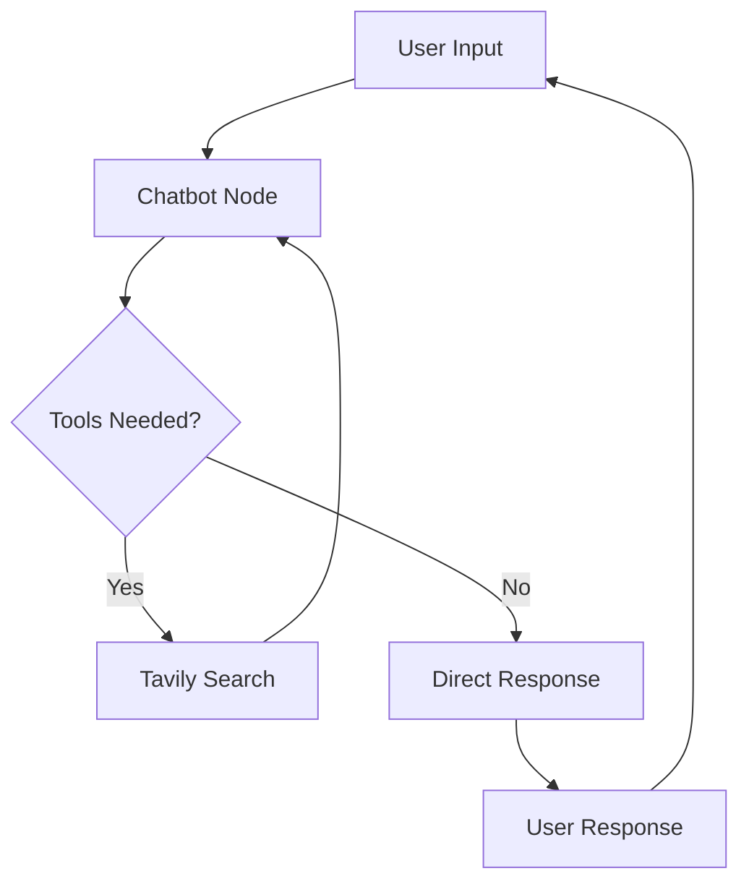

# AI Agent with LangGraph, Azure OpenAI & Tavily Search

A sophisticated AI agent built with LangGraph that combines Azure OpenAI's conversational capabilities with Tavily's web search functionality. This agent can engage in natural conversations while accessing real-time information from the web when needed.

## ✨ Features

- 🤖 **Intelligent Conversational Agent** - Powered by Azure OpenAI GPT-4
- � **Web Search Integration** - Real-time information retrieval via Tavily Search
- 🔄 **Persistent Memory** - Maintains conversation context across interactions
- �️ **Tool-Based Architecture** - Automatically decides when to use web search
- � **Interactive Commands** - View graph structure and current state
- 🌐 **LangGraph Workflow** - Sophisticated state management and tool orchestration
- � **Memory Checkpointing** - Conversation history persistence
- 🎯 **Thread-based Sessions** - Isolated conversation threads

## 🏗️ Architecture

This agent uses a **conditional tool-calling architecture** where:

1. **User Input** → **Chatbot Node** (GPT-4 processes the request)
2. **Tool Decision** → **Conditional Edge** (AI decides if web search is needed)
3. **Tool Execution** → **Tavily Search** (if information retrieval is required)
4. **Response Generation** → **Chatbot Node** (Final response with enriched context)

## 🚀 Quick Start

### 1. Setup Environment

```bash
# Make setup script executable
chmod +x setup.sh

# Run automated setup
./setup.sh
```

### 2. Configure Credentials

Create a `.env` file with your credentials:

```env
# Azure OpenAI Configuration
AZURE_OPENAI_API_KEY=your_azure_openai_api_key
AZURE_OPENAI_ENDPOINT=https://your-resource.openai.azure.com/
AZURE_OPENAI_API_VERSION=2024-02-15-preview
AZURE_OPENAI_DEPLOYMENT_NAME=your_gpt4_deployment_name

# Tavily Search Configuration
TAVILY_API_KEY=your_tavily_api_key
```

### 3. Run the Agent

```bash
# Activate virtual environment
source venv/bin/activate

# Start the agent
python agent.py
```

## 🔧 Manual Setup

If you prefer to set up manually:

### 1. Create Virtual Environment

```bash
python3 -m venv venv
source venv/bin/activate  # On Windows: venv\Scripts\activate
```

### 2. Install Dependencies

```bash
pip install --upgrade pip
pip install -r requirements.txt
```

### 3. Configure Environment

```bash
# Create your .env file with the required credentials
touch .env
```

### 4. Run the Agent

```bash
python agent.py
```

## 📁 Project Structure

```
ai-agent-langgraph/
├── agent.py              # Main agent implementation with LangGraph workflow
├── state.py              # State management for conversation context
├── tool_nodes.py         # Tool node definitions (if any custom tools)
├── requirements.txt      # Python dependencies
├── setup.sh             # Automated setup script
├── .env                 # Environment variables (create from template)
├── README.md            # This documentation
└── __pycache__/         # Python cache files
```

## 🛠️ How It Works

### LangGraph Workflow

The agent implements a sophisticated workflow using LangGraph:



### Core Components

1. **State Management** (`state.py`):
   - Manages conversation messages with LangGraph's `add_messages` annotation
   - Maintains thread-based conversation context

2. **Agent Logic** (`agent.py`):
   - **Chatbot Node**: Processes user input with Azure OpenAI
   - **Tool Integration**: Tavily Search for real-time information
   - **Conditional Edges**: AI-driven tool selection
   - **Memory Persistence**: Conversation checkpointing

3. **Tool Integration**:
   - **Tavily Search**: Up to 2 search results per query
   - **Automatic Tool Binding**: LLM decides when to search
   - **Context-Aware Responses**: Enriched with search results

## 💡 Usage Examples

### Basic Conversation

```
User: Hello! How are you?
Assistant: Hello! I'm doing well, thank you for asking. I'm here and ready to help you with any questions or tasks you might have. How can I assist you today?

User: What's the current weather in New York?
Assistant: [Automatically searches for current weather information]
Based on the latest information, the current weather in New York is... [provides real-time weather data]
```

### Special Commands

The agent supports these special commands:

```bash
# View the LangGraph structure
graph

# Check current conversation state
state

# Exit the conversation
quit / exit / q
```

### Web Search Integration

The agent automatically determines when to search for information:

```
User: What are the latest developments in AI?
Assistant: [Automatically triggers Tavily search for recent AI news]
Based on the latest information I found... [provides current AI developments]
```

## ⚙️ Configuration

### Required Environment Variables

| Variable                       | Description           | Required | Example                                 |
| ------------------------------ | --------------------- | -------- | --------------------------------------- |
| `AZURE_OPENAI_API_KEY`         | Azure OpenAI API key  | Yes      | `abc123...`                             |
| `AZURE_OPENAI_ENDPOINT`        | Azure OpenAI endpoint | Yes      | `https://my-resource.openai.azure.com/` |
| `AZURE_OPENAI_API_VERSION`     | API version           | Yes      | `2024-02-15-preview`                    |
| `AZURE_OPENAI_DEPLOYMENT_NAME` | Model deployment name | Yes      | `gpt-4-1106-preview`                    |
| `TAVILY_API_KEY`               | Tavily Search API key | Yes      | `tvly-xyz123...`                        |

### Agent Configuration

The agent uses these optimized settings:

- **Model**: GPT-4 (via Azure OpenAI)
- **Search Results**: Maximum 2 results per query
- **Memory**: Persistent conversation checkpointing
- **Thread Management**: Timestamp-based session IDs

## 🚀 Key Dependencies

```python
langgraph>=0.2.0          # State graph workflow management
langchain>=0.2.0          # LangChain core functionality
langchain-openai>=0.1.0   # Azure OpenAI integration
langchain-tavily>=0.2.6   # Tavily search integration
python-dotenv>=1.0.0      # Environment variable management
langsmith>=0.4.4          # LangSmith integration (optional)
grandalf>=0.8.0          # Graph visualization support
```

## 🐛 Troubleshooting

### Common Issues

1. **Import Errors**
   ```bash
   # Ensure virtual environment is activated
   source venv/bin/activate
   pip install -r requirements.txt
   ```

2. **API Authentication Errors**
   ```bash
   # Check your .env file has all required variables
   cat .env
   ```

3. **Tavily Search Errors**
   - Verify your Tavily API key is valid
   - Check if you have remaining API credits
   - Ensure internet connectivity

4. **Azure OpenAI Connection Issues**
   - Verify your Azure OpenAI endpoint URL
   - Check deployment name matches your Azure setup
   - Ensure API version is supported

### Debug Commands

```bash
# Test environment variables
python -c "from dotenv import load_dotenv; import os; load_dotenv(); print('Azure:', bool(os.getenv('AZURE_OPENAI_API_KEY'))); print('Tavily:', bool(os.getenv('TAVILY_API_KEY')))"

# Check installed packages
pip list | grep -E "(langgraph|langchain|tavily)"
```

## 🚀 Advanced Features

### Custom Tool Integration

You can extend the agent with additional tools:

```python
from langchain_community.tools import WikipediaQueryRun
from langchain_community.utilities import WikipediaAPIWrapper

def get_tools():
    tools = [
        TavilySearch(max_results=2),
        WikipediaQueryRun(api_wrapper=WikipediaAPIWrapper()),
        # Add your custom tools here
    ]
    return tools
```

### Memory Persistence

The agent uses LangGraph's `MemorySaver` for conversation persistence. Each conversation thread is identified by a timestamp-based ID.

### Graph Visualization

Use the `graph` command during conversation to see the current workflow structure in Mermaid format.

## 🔮 Extending the Agent

This project provides a solid foundation for building more sophisticated AI agents:

### Possible Extensions

- **Multi-Modal Capabilities**: Add image processing with vision models
- **Document Processing**: Integrate PDF/document analysis tools
- **Database Integration**: Add SQL query capabilities
- **API Integrations**: Connect to external services and APIs
- **Custom Memory**: Implement vector-based long-term memory
- **Multi-Agent Systems**: Orchestrate multiple specialized agents
- **Web Interface**: Build a React/Streamlit frontend
- **Voice Integration**: Add speech-to-text and text-to-speech

### Development Tips

1. **Tool Development**: Create custom tools by inheriting from LangChain's `BaseTool`
2. **State Extensions**: Add custom fields to the `State` class for additional context
3. **Conditional Logic**: Use LangGraph's conditional edges for complex workflows
4. **Error Handling**: Implement robust error handling for production deployments

## 🤝 Contributing

Contributions are welcome! Here's how to get started:

1. Fork the repository
2. Create a feature branch: `git checkout -b feature/amazing-feature`
3. Make your changes and test thoroughly
4. Commit your changes: `git commit -m 'Add amazing feature'`
5. Push to the branch: `git push origin feature/amazing-feature`
6. Open a Pull Request

### Development Setup

```bash
# Clone your fork
git clone https://github.com/your-username/ai-agent-langgraph.git
cd ai-agent-langgraph

# Set up development environment
./setup.sh

# Install development dependencies (if any)
pip install -r requirements-dev.txt
```

## 📜 License

This project is open source and available under the [MIT License](LICENSE).

## 🙏 Acknowledgments

- **LangChain Team** - For the incredible LangChain ecosystem
- **LangGraph** - For sophisticated agent workflow management
- **Azure OpenAI** - For powerful language model capabilities
- **Tavily** - For reliable web search integration

---

**Built with ❤️ using LangGraph and Azure OpenAI**

*Happy coding! 🚀*
